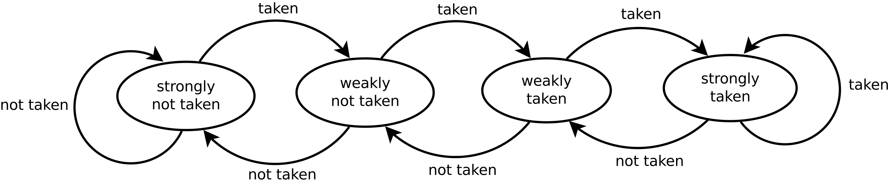

# **RISC-V RV32I Processor Coursework**
#### *Carys Leung | CID: 02565398 | GitHub: zenbean*
# Personal Statement
## Overview of Contribution
### Reduced RISC-V (Lab 4)
- Decode stage
  - Instruction Memory
  - Control unit
  - Sign extension
- General debugging

### Single Cycle
- All stages: Fetch, Execute, Decode, Memory and Writeback
  - Building on top of my team's already existing work from Lab 4
- PDF simulation on Vbuddy using testbench

### Single Cycle + Pipelining
- General debugging and modification of components to accommodate pipelining
  - Control unit (Change of I/O)
  - Addition of branch unit
  - Updated instruction memory (byte addressing)
  - Propagating signals through pipeline stages (`pip_reg_d.sv`)

### Full RV32I + Pipelining (Stretch goal 3)
- Implemented the remaining R type, S type, U type instructions
- Testing of implemented instructions

### Dynamic Branch Prediction
- Designed 2 bit saturating counter state machine to replace the static branch prediction model
	- Pattern history table
	- Branch target buffer
- Changes to fetch and execute stage to provide predictions and feedback results to the branch predictor

### Testing and Verification
- Created testbenches and assembly code to test multiplication and branch prediction functionalities

### Project Management
- Version control
  - Merge conflict resolutions
  - Feature branching
- Team coordination
  - Peer review/testing of components

## Single Cycle Processor
### Overview
The single cycle processor served as the foundation for our coursework, establishing the framework on which all later stretch goals and optimisations would build on. Therefore, ensuring this foundation was robust and compliant with the RISC-V specification was a primary focus.


### Key Challenges and Solutions
#### Memory Redesign (Byte Addressing)
During the initial design phase, I identified a critical flaw in our assumption that all memory accesses would be word-aligned. This assumption would have caused two major failures: 
- All addresses would be restricted to multiples of 4
- Not possible to write a single byte to memory without corrupting the adjacent three bytes in that word

To resolve this, I redesigned both the instruction and data memory modules to support true byte-level addressing.

Instruction Memory (`instr_mem.sv`): To support fetching 32 bit instructions from a byte addressable ROM, I implemented logic to concatenate four distinct bytes for every read. This ensures that the processor can handle unaligned accesses if necessary and strictly adheres to little endian ordering.

```systemverilog
always_comb begin
    // Piece together 32-bit word from 4 bytes (Little Endian)
    RD_o = {
        rom_array[A_i + 3], 
        rom_array[A_i + 2], 
        rom_array[A_i + 1], 
        rom_array[A_i + 0]
    }; 
end
```

Data Memory (`data_memory.sv`): 
I modified the write logic to use the `funct3` field, allowing the memory controller to distinguish between full-word stores and byte stores. This logic ensures that a `sb` operation only updates the targeted 8 bit index in the ram_array without overwriting neighbouring bytes.

```systemverilog
// Memory write logic handling granularity
always @(posedge clk_i) begin
    if (wr_en_i) begin
        if (funct3_i == 3'b010) begin // Store Word (SW)
            ram_array[addr_i[16:0]]     <= data_i[7:0];
            ram_array[addr_i[16:0] + 1] <= data_i[15:8];
            ram_array[addr_i[16:0] + 2] <= data_i[23:16];
            ram_array[addr_i[16:0] + 3] <= data_i[31:24];
        end else begin // Store Byte (SB)
            ram_array[addr_i[16:0]] <= data_i[7:0];
        end
    end
end
```

#### Architectural Compliance (Register x0)
I also addressed a critical compliance issue of register `x0`. In our initial Lab 4 implementation, `x`0 was implemented as a general-purpose register, meaning it could be overwritten. This violates the RISC-V specification, where register `x0` is hardwired to zero. I modified `regfile.sv` to enforce this in hardware: writes to address 0 are now ignored, and reads from address 0 always return zero.

```systemverilog
// Write Logic: Prevent writing to x0
always_ff @(posedge clk_i) begin
    if (WE3_i && (A3_i != 5'b0)) begin 
        mem[A3_i] <= WD3_i;
    end
end

// Read Logic: Hardwire x0 to 0
assign RD1_o = (A1_i == 5'b0) ? {DATA_WIDTH{1'b0}} : mem[A1_i];
assign RD2_o = (A2_i == 5'b0) ? {DATA_WIDTH{1'b0}} : mem[A2_i];
```

#### Assembly Code Analysis
Once these critical issues were resolved, the next challenge was defining the minimum required instructions to run all test cases. By analysing the provided assembly files and breaking down pseudoinstructions into their basic RISCV instructions, we determined that a subset of 18 distinct instructions (including `LUI`, `JAL`, `JALR`, and basic arithmetic) would be sufficient to pass all basic test cases. This analysis allowed us to prioritise our implementation efforts effectively.

Running PDF test case on the Vbuddy posed a unique challenge. Initially, the output plot on the VBuddy display appeared stretched and exceeded the screen's horizontal resolution. After a closer look at the assembly code, I observed that the output register `a0` only updated every 4 clock cycles. To resolve the display issue, I modified the C++ testbench to sample and plot the output only on every 4th cycle, compressing the graph to fit the display correctly. Additionally, I set the trigger signal to assert automatically within the testbench logic, to allow for fully automated testing without the need for manual hardware interaction.

```assembly
display:    # function send PDF array value to a0 for display
    LI      s1, 0               # s1 = counter to sum pdf values (not in original)
    LI      a1, 0               # a1 = offset into pdf array
    LI      a2, 255             # a2 = max index of pdf array
_loop3:                         # repeat
    LBU     a0, base_pdf(a1)    #   a0 = mem[base_pdf+a1)
    ADD     s1, s1, a0          #   s1 += mem[base_pdf+a1)
    ADDI    a1, a1, 1           #   incr
    BNE     a1, a2, _loop3      # until end of pdf array
    RET
```

#### Commits
1. [Update adder](https://github.com/IAC-Group-2/Project_Brief/commit/fc0606ed0b0b42fd182e0f3b42a4f86050a3f606)
2. [Update ALU](https://github.com/IAC-Group-2/Project_Brief/commit/48514823e677811ac4fc51ae20a1a36dc54a9ac3)
3. [Update control unit](https://github.com/IAC-Group-2/Project_Brief/commit/7af06bbcaadd5ff88a5f45d7d873617b883710c5)
4. [Update data memory](https://github.com/IAC-Group-2/Project_Brief/commit/9cbcc6f401048e5e0dbc6e8858fc631434423984)
5. [Update instruction memory](https://github.com/IAC-Group-2/Project_Brief/commit/092e7db949fe267afebbdefc4d96de59db04b14d)
6. [Update PC mux](https://github.com/IAC-Group-2/Project_Brief/commit/b8e943789a1497b667547fe45e40855a5b29d339)
7. [Update PC register](https://github.com/IAC-Group-2/Project_Brief/commit/b5f955f03d117b053bd5f36adb1d5a138109b1b8)
8. [Update register file](https://github.com/IAC-Group-2/Project_Brief/commit/3834e1c0f118c910097d881f81ab23242785a81a)
9. [Added necessary files to support Vbuddy and PDF testbench](https://github.com/IAC-Group-2/Project_Brief/commit/a7289ffeb02520c2fcb34e5a95f9b5877110a36a)
10. [Updated top module](https://github.com/IAC-Group-2/Project_Brief/commit/574af08b860a52e68e17a26355949ea86eb17724)

## Full Base Instruction Set (RV32I)
### Overview

Implementing the complete RV32I base instruction set was the natural progression after establishing a working single cycle processor. Due to the number of remaining instructions, I coordinated with Anthony to split the workload by instruction type. My specific focus was on implementing the remaining R-type , S-type, and U-type instructions.

|Instruction Type	|Instructions Implemented|
|--|--|
|R-Type	|`XOR`, `SRL`, `SRA`, `SLTU`|
|S-Type|`SH`|
|U-Type|`AUIPC`|


### Key Challenges and Solutions
#### Expanded ALU and Decoding Logic

The most significant challenge in the control logic was distinguishing between instructions that share the same opcode and funct3 fields. In our initial design, we only supported `SLL`. To support `SRL` and `SRA`, I had to expand the `ALUControl_o` signal width to 4 bits and update the decoder to check the `funct7` field.

As shown in the code below, the decoder now checks the `funct7` bit (specifically bit 30) to differentiate between a logical shift and an arithmetic shift, as well as supporting the new logical operations such as `XOR` and `SLTU`

```systemverilog
// Updated ALU Decoder handling funct7 collision and new operations
always_comb begin
    case(ALUOp)
        // ... (Basic ADD/SUB/LUI cases) ...
        
        // R-Type or I-Type
        2'b10: begin
            case (funct3_i)
                3'b000: ALUControl_o = (funct7_i && op_i[5]) ? 4'b0001 : 4'b0000; // SUB / ADD
                3'b001: ALUControl_o = 4'b0101; // SLL
                3'b010: ALUControl_o = 4'b1000; // SLT
                3'b011: ALUControl_o = 4'b1001; // SLTU (Added)
                3'b100: ALUControl_o = 4'b0100; // XOR  (Added)
                3'b101: ALUControl_o = (funct7_i) ? 4'b0111 : 4'b0110; // SRA / SRL (Added)
                3'b110: ALUControl_o = 4'b0011; // OR
                3'b111: ALUControl_o = 4'b0010; // AND
                default: ALUControl_o = 4'b0000;
            endcase
        end
        default: ALUControl_o = 4'b0000;
    endcase
end
```

#### Architectural Changes for AUIPC

Implementing `AUIPC` presented a unique structural challenge. Standard arithmetic instructions operate on register values (`Rs1`), but `AUIPC` requires adding an immediate to the program counter. Since the ALU had no existing physical connection to the PC, I introduced a new multiplexer on ALU source A.

I created a new control flag, `ALUSrcA_o`, in the Control Unit. When asserted (for `AUIPC` instructions), this signal directs the top level multiplexer to route the current PC into the ALU instead of `Rs1`

#### Pipeline Integration

Integrating these instructions into the pipelined architecture added a layer of complexity regarding signal propagation and hazard management.
- Signal Propagation: Unlike the single cycle design, control signals generated in the decode stage (similar to new `ALUSrcA` and expanded data width `ALUControl`) had to be physically propagated through the pipeline registers (`pip_reg_e`) to reach the ALU in the execute stage
- `JALR` Hazards: While `JAL` targets can be computed relatively early, `JALR` targets are calculated in the execute stage using the ALU. This required careful management of the data path to ensure the calculated address was correctly fed back to the PC Mux, and that the hazard unit correctly flushed the instructions fetched during the calculation cycles

#### Commits
1. [Updated ALU to support full base instruction set](https://github.com/IAC-Group-2/Project_Brief/commit/1cf7040907fb5e74af49632653ba8ab955b0de18)
2. [Updated many components (control, ALU, data memory, execute pipeline register, etc..) to support full base instruction set](https://github.com/IAC-Group-2/Project_Brief/commit/ac07214b35807e0bf7876367ae50855d2f39a9e5)

## Dynamic Branch Prediction
### Overview

To further optimise our fully pipelined processor, I implemented dynamic branch prediction as a stretch goal. The primary motivation was to mitigate the high performance penalty of control hazards. In our pipeline design, flushing after a taken branch wastes 2 clock cycles. If a program contains many loops, this latency significantly degrades throughput.


#### Design Development

Initially, I considered implementing a complex finite state machine with enumerated states for prediction. However, I realized this approach was overengineered and would result in excessive hardware overhead during synthesis. Instead, I opted for a 2 bit Saturating Counter, which is lightweight and provides necessary stability by requiring two consecutive mispredictions to change its bias.

This state machine transitions between four states:

    00: Strongly Not Taken

    01: Weakly Not Taken

    10: Weakly Taken

    11: Strongly Taken



To support this logic, I implemented two parallel data structures:

- Pattern History Table (PHT): Stores the 2 bit state for recent branches

- Branch Target Buffer (BTB): Caches the calculated target address

#### Pipeline Integration Challenges

Integrating the branch predictor into the pipeline presented a significant synchronization challenge: the decision to jump happens in the fetch stage, but the validation of that decision doesn't happen until the execute stage two cycles later. Since I did not modify the hazard unit directly, I had to ensure the data path itself could handle this decision-making process robustly
1. Propagating the signal:

    To detect a misprediction, the execute stage needs to know what the fetch stage guessed two cycles ago. I couldn't just compare the current PC; I had to propagate the prediction status down the pipeline

    **Solution:** I expanded the pipeline registers (`pip_reg_d` and `pip_reg_e`) to carry the `PredictTaken` signal alongside the instruction. This ensures that when an instruction reaches the execute stage, it arrives with its prediction, allowing the branch unit to simply compare TakenE (Actual) vs. PredictTakenE (Guessed)

2. Prioritised PC multiplexer logic (`mux_reg.sv`)

    The program counter update logic became significantly more complex. In the single cycle design, the decision was binary (Branch or PC+4). With prediction, the PC mux now has to choose between three

    Solution: I redesigned the mux_reg to implement a priority system.
    - Correction (Highest Priority): If `MispredictE` is high, PC must immediately revert to the correct path
    - Prediction: If no misprediction, but branch predictor "Taken" (PredictTakenF), jump to the cached target
    - Default: Otherwise, proceed to PC+4

```systemverilog
// mux_reg.sv: implementing priority logic
always_comb begin
    if (MispredictE_i) begin
        // Correction: If we guessed wrong, restore the correct path
        if (PCSrcE_i) PCNext_o = ActualTargetE; // Should have taken
        else          PCNext_o = PCPlus4E_i;    // Should have not taken
    end
    else if (PredictTakenF_i) begin
        // Prediction: If predictor says taken, jump to cached target
        PCNext_o = PredictTargetF_i;
    end
    else begin
        // Default
        PCNext_o = PCPlus4F_i;
    end
end
```

3. Feedback loop
    
    The branch predictor requires a feedback loop that spans the entire pipeline. The branch target buffer needs the calculated address from the execute stage (`PCTargetE`) to update its cache, but this data is only valid if `BranchE` is high. I designed the `branch_predict.sv` module to accept these signals from the execute stage while simultaneously outputting predictions for the fetch stage in the same clock cycle

#### Commits
1. [Added branch prediction submodule](https://github.com/IAC-Group-2/Project_Brief/commit/2a12e96b46d5b841e18eb7c124a1aa5e837a7fec)
2. [Updated PC selection logic is PC multiplexer](https://github.com/IAC-Group-2/Project_Brief/commit/ff0d2d4fc09d3364b68d6ada7dc0d758dad12bd5)
3. [Updated prediction signals through pipeline registers for flushing](https://github.com/IAC-Group-2/Project_Brief/commit/77fbc94727ed505d311647b322b9aa5b71bd5329)
4. [Rebase and merge of feature branch with main](https://github.com/IAC-Group-2/Project_Brief/commit/24e75aa7358aad90caa14284e56da97296be5dc6)

## Testing and Verification
### Collaborative Debugging

Our team adopted a rigorous integration testing strategy. After merging individual feature branches, we frequently encountered integration bugs that did not appear in unit tests. Anthony and I adopted a pair-programming approach to tackle these, reviewing each other’s code to identify edge cases the original author might have overlooked.

**Example: Multiplication verification**

 A key instance of this was the verification of the multiplication extension. The initial testbench used simple positive integers, which failed to expose issues with sign extension. I wrote a comprehensive assembly test suite covering signed, unsigned, and mixed-mode multiplication (MUL, MULH, MULHSU). This rigorous testing revealed bit-width mismatches in the upper-word calculation that had initially gone undetected.

### Commits (Multiplication testing)
1. [Update design to suport 64 bit precision](https://github.com/IAC-Group-2/Project_Brief/commit/03ff3c861e18eea8d9691a325240907aff57497a)
2. [More thorough test cases](https://github.com/IAC-Group-2/Project_Brief/commit/be5f7739fcb2e1b8c0ba17cf47cd632f3e905aea)

For the branch predictor, relying solely on full system simulation was inefficient due to the complexity of the pipeline. I created a dedicated C++ testbench (branch_predict_tb.cpp) to verify the component in isolation. This allowed me to simulate specific training sequences—such as repeatedly taking a branch 20 times to force the counter into a "strongly taken" state, verifying the logic works correctly before integrating it into the main processor.
### Commits (Branch prediction testing)
1. [Component and System simulation](https://github.com/IAC-Group-2/Project_Brief/commit/24e75aa7358aad90caa14284e56da97296be5dc6)
## Project Management
### Version Control & Workflow

Prior to this coursework, my experience with Git was limited to personal repositories. Managing a shared codebase introduced challenges such as merge conflicts and branch protection rules. I developed a workflow involving feature branching, where I and Anthony would work on isolated branches for specific tasks (e.g. multiplication) and rebasing main into my branch locally to resolve conflicts before pushing. This minimised disruptions to the main branch.
### Team Dynamics

To manage the workload efficiently, we decided that splitting into pairs to tackle different stretch goals. This allowed for parallel development while ensuring every line of code was reviewed by at least one other person. We maintained momentum through frequent asynchronous updates on WhatsApp and video calls to resolve time-sensitive bugs or issues.

## Conclusion and Reflection
### Main Takeaways
This project significantly deepened my understanding of computer architecture, particularly the intricacies of pipelining. Although I did not design the hazard unit or pipelining, implementing the branch predictor and `AUIPC` instructions required me to deeply understand how data and control signals propagate through the pipeline stages. I learned that in hardware design, a decision made in fetch often has complex effects that must be managed in execute or writeback stages.
### Mistakes & Lessons Learned

1. Delayed Testing: In the early stages, I was often negligent regarding immediate verification, preferring to "build now, test later." This led to a "debugging debt" where simple bugs (like the x0 overwrite issue) were buried under layers of new logic, making them significantly harder to isolate later.

2. Documentation & Design Discipline: I often rushed into coding without fully mapping out the signal widths or wire connections, leading to careless syntax errors or mismatched bus widths that wasted hours of debugging time.
Future Improvements

If I were to repeat this project, I would maintain a log to document my logic before programming. Writing down the state transitions or signal paths first would force me to slow down and validate my thinking, likely preventing the careless connectivity bugs I encountered. Furthermore, I would enforce a more test driven approach, ensuring that every new module has a passing testbench before it is ever merged into the main pipeline.

### Acknowledgements
I am grateful to have worked with such a dedicated team (Anthony, Josh, Yichan). The collaborative environment and willingness to communicate made this technical coursework even more enjoyable
